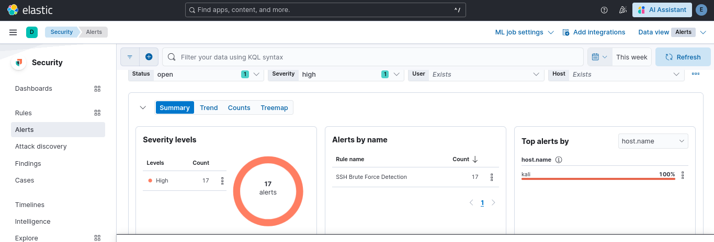

# SSH Security Monitoring & Brute-Force Detection System (ELK Stack)

## Project Overview
This project demonstrates a real-time Security Operations Center (SOC) solution for monitoring and analyzing SSH authentication logs. By utilizing the **ELK Stack** (Elasticsearch, Logstash, Kibana), I transformed raw system logs into an interactive security dashboard to detect and investigate Brute-Force attack patterns.

## System Architecture
The system follows a standard data pipeline for security logging:
1. **Data Collection:** Logs are gathered from `/var/log/auth.log` on a Victim Linux server.
2. **Data Shipper:** **Filebeat** monitors the log files and ships them to Logstash.
3. **Data Processing:** **Logstash** uses custom **Grok filters** to parse the raw text into structured fields.
4. **Storage & Indexing:** **Elasticsearch** stores the processed logs for high-speed searching.
5. **Visualization:** **Kibana** provides the final analytical dashboard.

> **Architecture Diagram:**
> 

## 🛡️ Detection Capabilities & Troubleshooting
Building a SOC isn't just about connecting tools; it's about solving data gaps. Below are the key technical milestones achieved:

### 1. Data Validation (The 568 Logs Milestone)
Before creating rules, I validated the data ingestion in Kibana **Discover**. This ensured that the 568 logs from the Kali Linux attack were correctly indexed with fields like `event.outcome`.

### 2. Fixing Index Pattern Mismatches
**Challenge:** The detection engine couldn't find the logs due to static naming.
**Solution:** I implemented a Wildcard Index Pattern `ssh-security-*`. This allowed the SIEM to dynamically monitor all current and future logs.

### 3. Overcoming Time-Drift with Backfill
**Challenge:** Alerts weren't showing because the attack happened in the past (Dec 24).
**Solution:** I configured the **Look-back time** to **4 Days**. This "backfilled" the detection engine, forcing it to analyze historical data and generate the missing alerts.

## 🚨 Final Security Alerts Dashboard
The result is a fully functional SIEM rule that monitors SSH traffic. When a brute-force attack is detected, the system triggers a **High Severity Alert**.

- **Detection Query:** `event.outcome : "failure"`
- **Rule Status:** `Succeeded` (Real-time Monitoring Active)

### 🚨 Alert Intelligence & Deep Dive
The system doesn't just detect; it analyzes. Below is the breakdown of the 135 high-severity alerts generated:
| **Alerts Count** | **135 Alerts** |  |

| Metric | Visual Evidence | Key Insight |
| :--- | :--- | :--- |
| **Attacker IP** |  | Targeted from `192.168.192.5` (52.9%) |
| **Targeted User** |  | High focus on `fakeuser` account |
| **Victim Host** |  | 100% of attempts targeted the `kali` server |

### 🧠 Detection Logic & Rule Configuration
To minimize false positives while maintaining high security, the **SSH Brute Force Detection** rule was configured with the following parameters:

| Rule Attribute | Value | Technical Justification |
| :--- | :--- | :--- |
| **Threshold** | 5+ Failures | To filter out accidental typos and legitimate login mistakes from actual brute-force attacks. |
| **Time Window** | 5 Minutes | Designed to capture high-frequency, automated login attempts typical of tools like Hydra or Medusa. |
| **Severity** | **High** | SSH is a critical entry point; repeated unauthorized access attempts on a host like `kali` pose a severe risk. |

> **Operational Note:** With these settings, the system successfully identified and grouped the attack into **135 distinct alerts**, providing a clear timeline of the incident.

## Key Features & Analytics
The dashboard is designed to answer critical security questions:
* **Who is the Attacker?** (Top Source IPs)
* **When did the attack happen?** (Failed Logins Over Time)
* **What is the attack pattern?** (Advanced Heatmap Timeline)
* **Was the system breached?** (Success vs. Failure Ratio)

## How to Use
1. Clone this repository.
2. Install the ELK Stack (Docker or Manual).
3. Copy the `logstash.conf` file to your Logstash configuration directory.
4. Import the provided Kibana Dashboard (NDJSON).
5. Start monitoring your SSH logs in real-time!

## Future Work
🔹Add SOAR automation (IP blocking)
🔹 Integrate Wazuh (HIDS)
🔹 Add Suricata (NIDS)
🔹 Case management with TheHive

---
**Author:** [Othmane Benmezian]
**Focus:** Cybersecurity | SIEM | Threat Hunting
