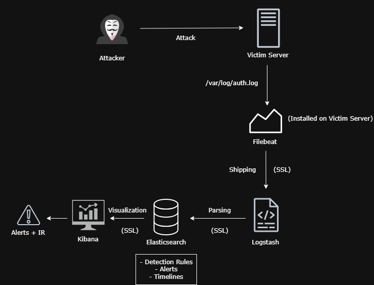
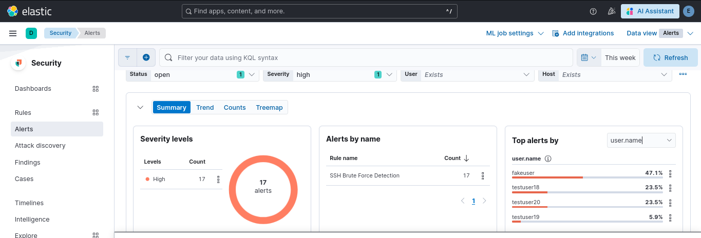

## SSH Security Monitoring & Brute-Force Detection (ELK Stack)

## Project Overview
This project implements a comprehensive **Security Operations Center (SOC)** environment designed to monitor, detect, and analyze SSH Brute-Force attacks in real-time. By leveraging the **ELK Stack**, I transformed raw system logs into an actionable security intelligence platform.

## System Architecture (Secure Pipeline)
The pipeline is fully secured using **SSL/TLS encryption** to ensure data integrity.

1.  **Data Source:** Linux Server logs gathered from `/var/log/auth.log`.
2.  **Secure Shipping:** **Filebeat** ships logs via **SSL/TLS** to Logstash.
3.  **Processing:** **Logstash** normalizes data using custom **Grok filters**.
4.  **Storage:** **Elasticsearch** indexing secured with **API Key Authentication**.
5.  **Visualization:** **Kibana** provides real-time security analytics and dashboards.

##  SIEM Detection Rule Configuration
I configured a custom detection rule to identify automated brute-force patterns:

| Rule Attribute | Configuration | Technical Justification |
| :--- | :--- | :--- |
| **Detection Query** | `event.outcome : "failure"` | Specifically targets failed authentication attempts. |
| **Threshold** | 5+ Failures | Filters out accidental typos from automated attacks. |
| **Time Window** | 5 Minutes | Captures high-frequency tools like Hydra or Medusa. |
| **Severity** | **High** | Critical service (SSH) targeting; poses a severe security risk. |

##  Security Analytics & Intelligence
The custom dashboard provides deep visibility into the attack surface:

### 1. Attack Timeline (Sequence of Events)
This heatmap visualizes the **Timeline per Attacking IP**, highlighting the exact moments of peak intensity.

*Red blocks indicate peak attack frequency (≥23.2 attempts) from `192.168.192.5`.*

### 2. Alert Intelligence Breakdown
| Metric | Visual Evidence | Key Insight |
| :--- | :--- | :--- |
| **Total Alerts** | 135 High Severity | 100% of attacks targeted the `kali` server. |
| **Source IP** |  | 52.9% of traffic originated from `192.168.192.5`. |
| **Target User** |  | Targeted attempts were identified against the `fakeuser` account. |

##  Incident Response (IR) Workflow
I developed a structured protocol for handling these high-severity alerts:
1.  **Identify source IP:** Extract attacker details from the dashboard.
2.  **Check alert timeline:** Analyze frequency via the Timeline view.
3.  **Verify number of failed attempts:** Confirm if it exceeds the security threshold.
4.  **Check if attack is ongoing:** Determine the current status of the threat.
5.  **Decision:** Execute containment (Block IP) or continued monitoring.
6.  **Document incident:** Complete the forensic record for future mitigation.

##  How to Replicate
1.  **Clone the Repo:** `git clone https://github.com/BenmezOthmane/SSH-Security-Monitoring-Brute-Force-Detection-System.git`
2.  **Configuration:** Apply the provided `filebeat.yml` and `logstash.conf`.
3.  **Import Dashboard:** Use `export.ndjson` in Kibana's Saved Objects.

## Future Work
🔹Add SOAR automation (IP blocking)
🔹 Integrate Wazuh (HIDS)
🔹 Add Suricata (NIDS)
🔹 Case management with TheHive

---
**Author:** [Othmane Benmezian]
Focus: Cybersecurity & SOC Operations 🛠️ Skills Demonstrated: SIEM (ELK Stack) | Log Analysis | Threat Detection | Incident Response (IR)
