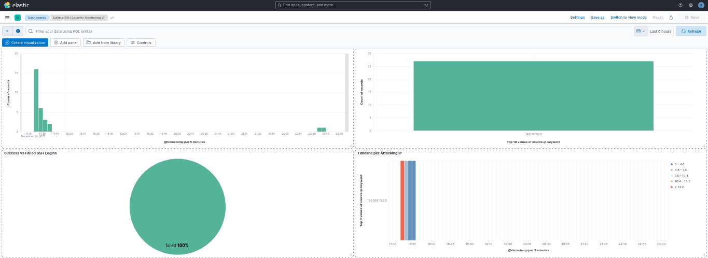

# SSH Security Monitoring & Brute-Force Detection System (ELK Stack)

## Project Overview
This project demonstrates a real-time Security Operations Center (SOC) solution for monitoring and analyzing SSH authentication logs. By utilizing the **ELK Stack** (Elasticsearch, Logstash, Kibana), I transformed raw system logs into an interactive security dashboard to detect and investigate Brute-Force attack patterns.

## System Architecture
The system follows a standard data pipeline for security logging:
1. **Data Collection:** Logs are gathered from `/var/log/auth.log` on a Victim Linux server.
2. **Data Shipper:** **Filebeat** monitors the log files and ships them to Logstash.
3. **Data Processing:** **Logstash** uses custom **Grok filters** to parse the raw text into structured fields.
4. **Storage & Indexing:** **Elasticsearch** stores the processed logs for high-speed searching.
5. **Visualization:** **Kibana** provides the final analytical dashboard.

> **Architecture Diagram:**
> 
## Key Features & Analytics
The dashboard is designed to answer critical security questions:
* **Who is the Attacker?** (Top Source IPs)
* **When did the attack happen?** (Failed Logins Over Time)
* **What is the attack pattern?** (Advanced Heatmap Timeline)
* **Was the system breached?** (Success vs. Failure Ratio)

## Technical Challenges & Solutions
### Grok Parsing Refinement
**Challenge:** Initially, the logs showed `_grokparsefailure` due to varying log formats (standard SSH vs. PAM module logs).
**Solution:** I engineered a multi-pattern Grok filter in Logstash to accurately extract:
- `source.ip`: Remote IP address of the attacker.
- `ssh_status`: Whether the attempt failed or succeeded.
- `user`: The targeted username.

> **View the full configuration:** > You can find the complete Logstash configuration file used in this project [here](./logstash-ssh.conf).

## Final SOC Dashboard

## How to Use
1. Clone this repository.
2. Install the ELK Stack (Docker or Manual).
3. Copy the `logstash-ssh.conf` file to your Logstash configuration directory.
4. Import the provided Kibana Dashboard (NDJSON).
5. Start monitoring your SSH logs in real-time!
---
**Author:** [Othmane Benmezian]
**Focus:** Cybersecurity | SIEM | Threat Hunting
